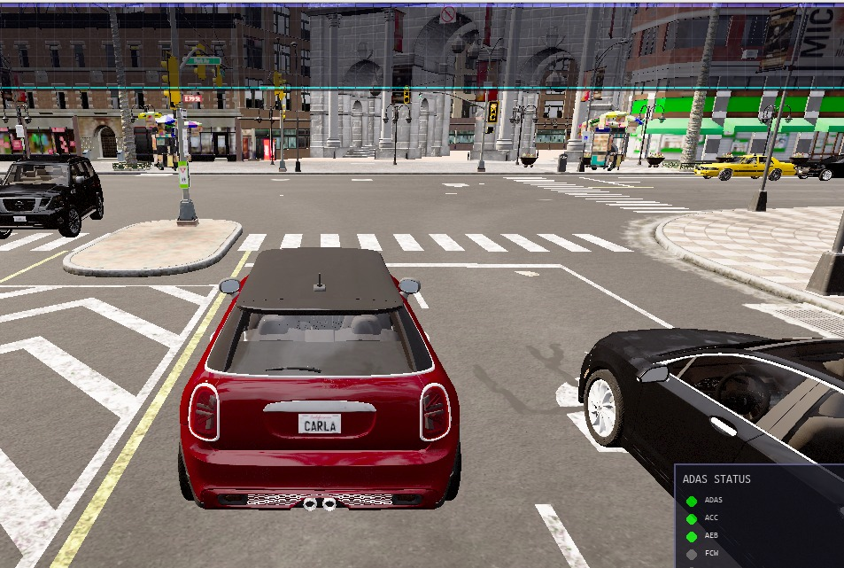
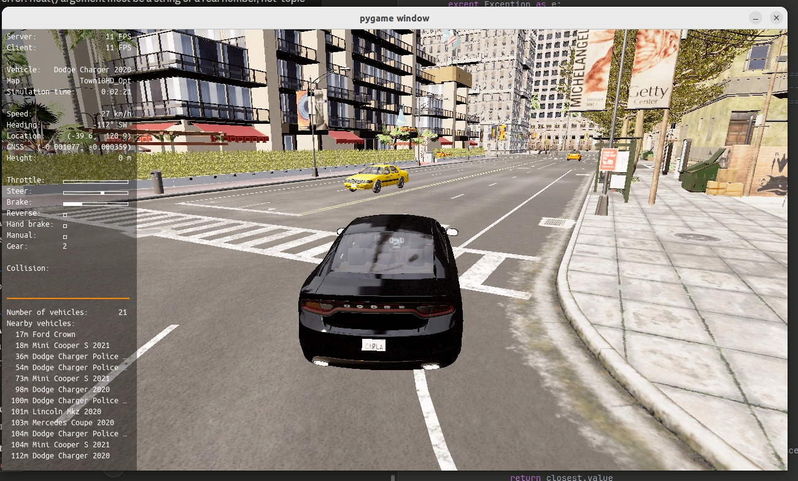
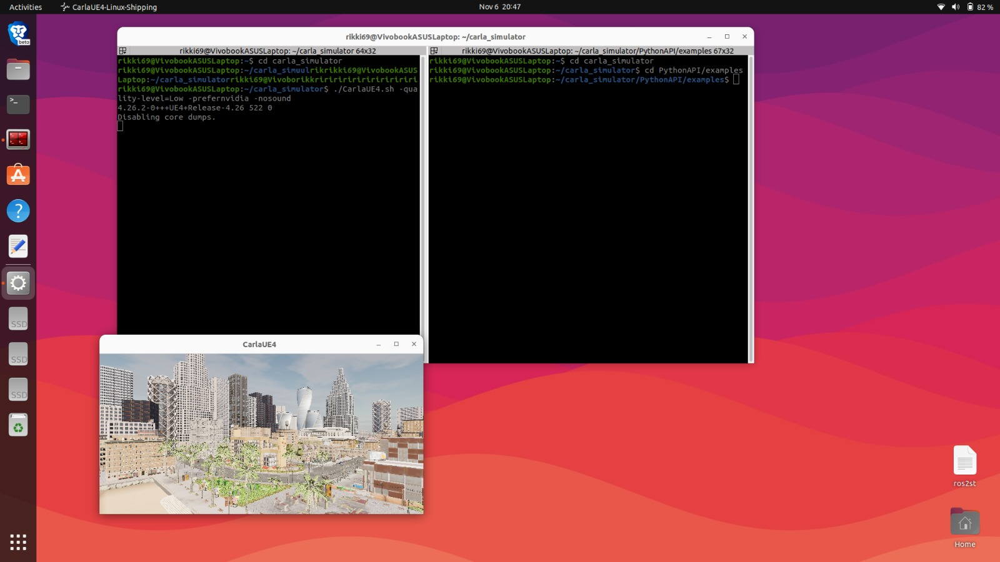
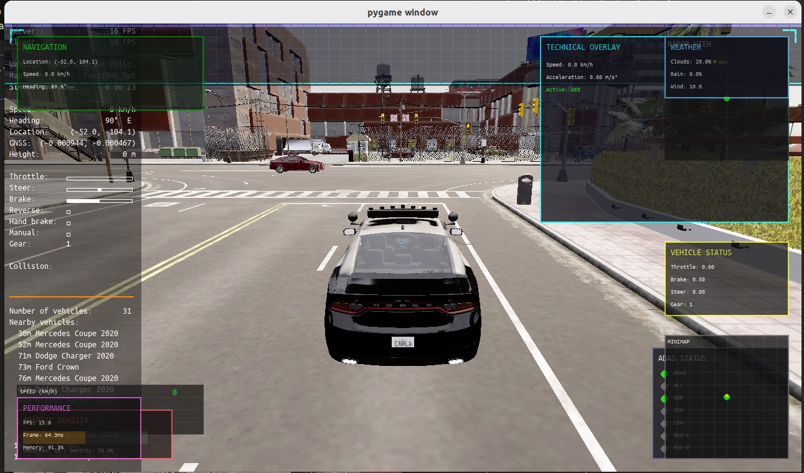
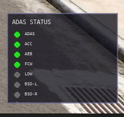
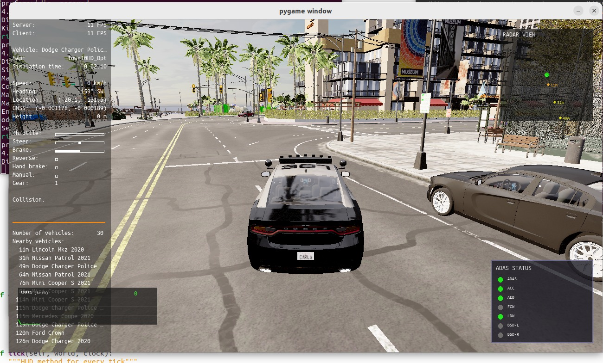
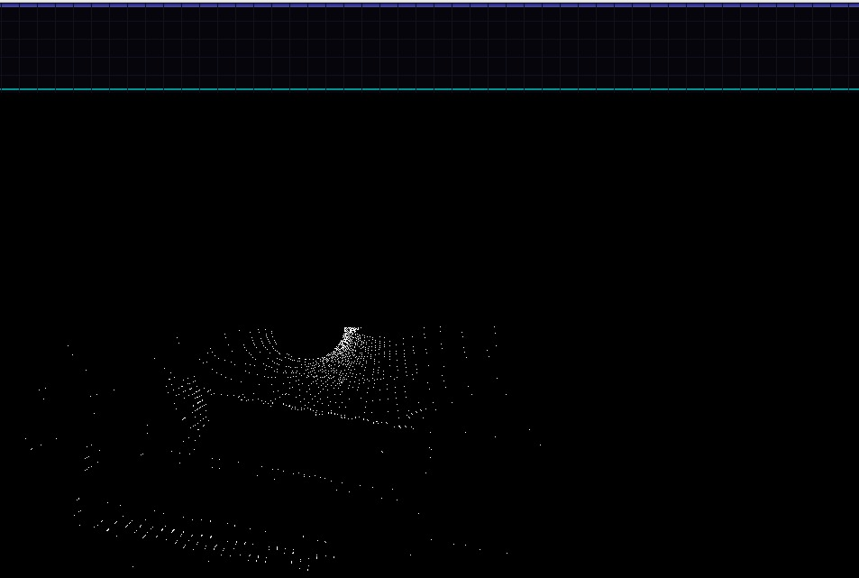

# CARLA ADAS Simulation System 

[]() 
[]() 
[]() 
[]() 
[]()

A high-fidelity, ISO-parameter-aligned Advanced Driver Assistance System (ADAS) development pipeline implemented inside the **CARLA Autonomous Driving Simulator**. This project demonstrates a complete **Simulation → Verification → Real-World Deployment** workflow for modular ADAS components.

---



---

## 🚀 Overview

TARA (Tracking Adaptive Road Autonomous Vehicle) is a modular ADAS software stack written in Python and validated inside **CARLA 0.9.x**. The system incorporates **ISO-certified ADAS behavioural thresholds** including:

- **ISO 15623** – Forward Collision Warning (FCW) TTC thresholds
- **ISO 15622** – Adaptive Cruise Control (ACC) distance/time-gap parameters
- **ISO 17361** – Lane Departure Warning (LDW) criteria
- **ISO 11452** – Environmental test modelling (weather, visibility)

After simulation validation, the software stack is deployable on embedded compute platforms (Raspberry Pi / Jetson Nano) for a 1:10 scale autonomous prototype.

---

## ✨ Features

### Core ADAS Systems

- **Forward Collision Warning (FCW)** – TTC estimation using ISO 15623 models
- **Automatic Emergency Braking (AEB)** – Immediate braking on critical TTC
- **Adaptive Cruise Control (ACC)** – ISO 15622-compliant distance regulation
- **Lane Departure Warning (LDW)** – Deviation analysis via CARLA topology
- **Blind Spot Detection (BSD)** – Lateral hazard region monitoring
- **Traffic Sign Recognition (TSR)** – Speed-limit detection
- **Intelligent Overtaking** – Safe-gap analysis and manoeuvre execution
- **Advanced Lane Detection** – Enhanced polynomial fitting/lane geometry
- **Sensor Visualization** – Multi-modal rendering (RGB, LiDAR, GNSS, etc.)



---

### Additional Features

- **Scenario Manager** for standardised testing
- **Synchronous Mode** for deterministic physics
- **Weather and Lighting Simulation** per ISO environmental testing
- **Traffic Generation** with varied behaviours
- **Real-time HUD** displaying ADAS telemetry (TTC, lane offset, speed limit)

---

## 📐 Mathematical Foundations

### 1. Forward Collision Warning (FCW) – Time-to-Collision (TTC)

**ISO 15623 Compliance**: Critical TTC threshold = 1.5s ± 0.2s

#### TTC Calculation

```
TTC = d_rel / v_rel
```

Where:
- `d_rel` = Relative distance between ego vehicle and lead vehicle (m)
- `v_rel` = Relative velocity (closing speed) in m/s

#### Vector-Based Relative Velocity

```
v_rel = √[(v_ego,x - v_lead,x)² + (v_ego,y - v_lead,y)² + (v_ego,z - v_lead,z)²]
```

#### Projected Closing Speed

For longitudinal safety, we project relative velocity onto the forward vector:

```
v_closing = v̄_rel · f̂_ego
```

Where:
- `v̄_rel` = Relative velocity vector
- `f̂_ego` = Unit forward vector of ego vehicle

**Alert Thresholds**:
- **Critical**: TTC < 0.8s → AEB activation
- **Warning**: 0.8s ≤ TTC < 2.0s → Visual/audible warning
- **None**: TTC ≥ 2.0s → No alert

---

### 2. Adaptive Cruise Control (ACC) – ISO 15622

#### Safe Following Distance

```
d_safe = v_ego · t_gap + d_min
```

Where:
- `v_ego` = Ego vehicle speed (m/s)
- `t_gap` = Time gap (default: 2.0s per ISO 15622)
- `d_min` = Minimum standstill distance (5.0m)

#### Speed Adjustment Algorithm

```
v_target = {
    max(0, v_lead - 10)     if d < d_safe
    v_lead                  if d_safe ≤ d < 1.5·d_safe
    min(v_set, v_lead + 5)  if d ≥ 1.5·d_safe
}
```

Where:
- `v_lead` = Lead vehicle speed (km/h)
- `v_set` = User-configured target speed (km/h)
- `d` = Current inter-vehicle distance (m)

#### Longitudinal Control Law

Proportional-Derivative (PD) controller:

```
a_ego(t) = K_p · e(t) + K_d · ė(t)
```

Where:
- `e(t) = d_safe - d_actual` (distance error)
- `K_p` = Proportional gain (tunable)
- `K_d` = Derivative gain (tunable)

---

### 3. Automatic Emergency Braking (AEB)

#### Brake Trigger Condition

```
AEB_active = (TTC < TTC_crit) ∧ (v_closing > v_min)
```

Where:
- `TTC_crit = 0.8s` (ISO 15623)
- `v_min = 0.5 m/s` (minimum closing speed threshold)

#### Deceleration Command

When triggered:

```
a_brake = -a_max = -9.81 m/s²  (1g emergency braking)
```

Brake force:

```
F_brake = m · a_brake
```

---

### 4. Lane Departure Warning (LDW) – ISO 17361

#### Lateral Offset Calculation

Using cross-product for perpendicular distance:

```
d_lateral = |Δx · f̂y - Δy · f̂x|
```

Where:
- `Δx = x_vehicle - x_lane_center`
- `Δy = y_vehicle - y_lane_center`
- `f̂ = (f̂x, f̂y)` = Lane direction unit vector

#### Lane Departure Criteria

```
LDW_state = {
    CRITICAL    if d_lateral > 1.5 · d_thresh
    WARNING     if d_thresh < d_lateral ≤ 1.5 · d_thresh
    NONE        if d_lateral ≤ d_thresh
}
```

Default: `d_thresh = 0.5m`

#### Time-to-Lane-Crossing (TLC)

```
TLC = (w_lane/2 - d_lateral) / v_lateral
```

Where:
- `w_lane` = Lane width (typically 3.5m)
- `v_lateral` = Lateral velocity component

---

### 5. Blind Spot Detection (BSD)

#### Detection Zone Definition

Blind spot region (rectangular approximation):

```
BSD_zone = {
    -2.0m < x_fwd < 5.0m  (longitudinal)
    1.5m < |y_lat| < 3.5m (lateral)
}
```

#### Coordinate Transformation

World coordinates → Vehicle-relative coordinates:

```
[x_rel]   [cos(θ)   sin(θ) ] [Δx]
[y_rel] = [-sin(θ)  cos(θ) ] [Δy]
```

Where:
- `θ` = Ego vehicle heading angle
- `Δx, Δy` = Difference from ego position

#### Threat Assessment

```
BSD_active = ∃ vehicle ∈ BSD_zone ∧ |v_rel| < v_thresh
```

---

### 6. Intelligent Overtaking

#### Safe Gap Analysis

Minimum safe overtaking distance:

```
d_overtake = v_ego · t_maneuver + 2 · d_safe
```

Where:
- `t_maneuver` = Estimated overtaking time (≈ 5-7s)
- `d_safe` = Safe following distance

#### Lateral Acceleration Constraint

Maximum lateral acceleration (comfort):

```
a_lat,max = v² / R_min ≤ 0.3g ≈ 3.0 m/s²
```

Minimum turn radius:

```
R_min = v² / a_lat,max
```

#### Overtaking Decision Matrix

```
Overtake = (v_ego > v_lead + Δv_min) ∧ (gap_left > d_min ∨ gap_right > d_min) ∧ (d_oncoming > d_safe)
```

---

### 7. Sensor Fusion & Kalman Filtering

#### State Vector (6-DOF)

```
x̄ = [x, y, z, vx, vy, vz]ᵀ
```

#### Prediction Step

```
x̄k|k-1 = F · x̄k-1|k-1 + B · ūk
Pk|k-1 = F · Pk-1|k-1 · Fᵀ + Q
```

Where:
- `F` = State transition matrix
- `B` = Control input matrix
- `Q` = Process noise covariance
- `P` = State covariance matrix

#### Update Step

```
Kk = Pk|k-1 · Hᵀ · (H · Pk|k-1 · Hᵀ + R)⁻¹
x̄k|k = x̄k|k-1 + Kk · (z̄k - H · x̄k|k-1)
Pk|k = (I - Kk · H) · Pk|k-1
```

Where:
- `H` = Observation matrix
- `R` = Measurement noise covariance
- `K` = Kalman gain

---

### 8. Lane Geometry Fitting

#### Polynomial Lane Model

3rd-order polynomial:

```
y(x) = a₀ + a₁·x + a₂·x² + a₃·x³
```

#### Least Squares Fitting

Minimize residual:

```
min Σ[yi - (a₀ + a₁·xi + a₂·xi² + a₃·xi³)]²
```

#### Curvature Calculation

```
κ(x) = |y''(x)| / [1 + y'(x)²]^(3/2)
```

Where:
- `y'(x) = a₁ + 2a₂·x + 3a₃·x²`
- `y''(x) = 2a₂ + 6a₃·x`

---

### 9. Performance Metrics

#### False Positive Rate (FPR)

```
FPR = FP / (FP + TN)
```

#### Detection Recall

```
Recall = TP / (TP + FN)
```

#### F1-Score

```
F1 = 2 · (Precision · Recall) / (Precision + Recall)
```

Where:
- `Precision = TP / (TP + FP)`

---

## 📋 Requirements

- Python 3.6+
- CARLA 0.9.x
- NumPy
- Pygame
- Matplotlib
- Pillow
- Open3D (optional)

---

## ⚙️ Installation

### 1. Install CARLA Simulator

```bash
# Download from https://github.com/carla-simulator/carla/releases
# Extract to your desired location
```

### 2. Install Python Dependencies

```bash
pip install -r requirements.txt
# or
pip3 install -r requirements.txt
```

### 3. Set up CARLA Python API

```bash
# Ensure CARLA Python API is in your Python path
# The script automatically searches for carla module
```

---

## 🎮 Usage

### Quick Start

**Step 1: Start CARLA Simulator**

```bash
cd carla_simulator
./CarlaUE4.sh -quality-level=Low -prefernvidia -nosound
```

**Step 2: Run the ADAS Simulation**

```bash
cd carla_simulator/PythonAPI/examples
python3 tara.py --sync --agent Behavior --loop -n 30
```

This command will:
- Run in synchronous mode (`--sync`)
- Use the Behavior agent (`--agent Behavior`)
- Loop to new destinations automatically (`--loop`)
- Spawn 30 traffic vehicles (`-n 30`)

---

### Command Line Options



```bash
python tara.py [OPTIONS]

Options:
  -v, --verbose            Print debug information
  --host H                 IP of the host server (default: 127.0.0.1)
  -p, --port P             TCP port to listen to (default: 2000)
  --tm-port P              Port to communicate with Traffic Manager (default: 8000)
  --res WIDTHxHEIGHT       Window resolution (default: 1280x720)
  --sync                   Enable synchronous mode execution
  --filter PATTERN         Actor filter (default: "vehicle.*")
  --generation G           Actor generation: "1", "2", or "All" (default: "2")
  -l, --loop               Sets new random destination upon reaching previous one
  -a, --agent AGENT        Agent type: "Behavior", "Basic", or "Constant" (default: "Behavior")
  -b, --behavior BEHAVIOR  Agent behavior: "cautious", "normal", or "aggressive" (default: "normal")
  -s, --seed SEED          Set seed for repeating executions
  -n, --num-vehicles N     Number of traffic vehicles to spawn (default: 50)
```

---

### Keyboard Controls

| Key | Action |
|-----|--------|
| `F1` | Toggle ADAS system ON/OFF |
| `F2` | Toggle Adaptive Cruise Control (ACC) |
| `F3` | Toggle Automatic Emergency Braking (AEB) |
| `F4` | Toggle Overtaking System |
| `F5` | Toggle All HUD Displays |
| `F6` | Show Scenario Menu |
| `ESC` / `Ctrl+Q` | Quit simulation |
| `TAB` | Cycle through camera views |
| `0-9` | Switch camera positions |
| `` ` `` | Toggle sensor visualization |

---

### Example Commands

```bash
# Recommended: Synchronous mode with Behavior agent
python3 tara.py --sync --agent Behavior --loop -n 30

# High-traffic scenario (100 vehicles)
python3 tara.py --sync -n 100 -b aggressive --res 1920x1080

# Reproducible testing with seed
python3 tara.py -v -s 42 --agent Behavior

# Intensive ADAS stress test
python3 tara.py --sync --agent Behavior --loop -n 50
```

---

## 📸 Screenshots

### Main Simulation View

*Main simulation view showing the vehicle with ADAS systems active*

### ADAS HUD Display

*Real-time ADAS status display showing FCW, ACC, LDW, and other system states*

### Forward Collision Warning

*Forward Collision Warning system detecting an obstacle ahead with TTC calculation*

### Sensor Visualization

*Multi-sensor visualization showing camera, LiDAR, and GPS data*

### LiDAR Point Cloud


---

## 🏗️ Architecture

### System Components

```
tara.py
├── ADASManager                    # Central ADAS system coordinator
├── AdaptiveCruiseControl          # ACC implementation (ISO 15622)
├── ForwardCollisionWarning        # FCW implementation (ISO 15623)
├── AutomaticEmergencyBraking      # AEB implementation
├── LaneDepartureWarning           # LDW implementation (ISO 17361)
├── BlindSpotDetection             # BSD implementation
├── TrafficSignRecognition         # TSR implementation
├── IntelligentOvertaking          # Overtaking system
├── AdvancedLaneDetection          # Lane geometry & polynomial fitting
├── SensorRangeVisualization       # Detection zone rendering
├── ScenarioManager                # Scenario testing framework
├── World                          # CARLA world management
├── HUD                            # Heads-up display
└── CameraManager                  # Camera sensor management
```

---

### ADAS System Flow

```
┌─────────────────────────────────────────────────────────────────┐
│                    Sensor Data Collection                        │
│  (Camera, LiDAR, GPS, IMU, Collision Sensors)                   │
└────────────────────────┬────────────────────────────────────────┘
                         │
                         ▼
┌─────────────────────────────────────────────────────────────────┐
│                     ADAS Processing Layer                        │
│  ┌──────────┐  ┌──────────┐  ┌──────────┐  ┌──────────┐        │
│  │   FCW    │  │   ACC    │  │   LDW    │  │   BSD    │        │
│  └────┬─────┘  └────┬─────┘  └────┬─────┘  └────┬─────┘        │
│       │             │             │             │                │
│       └─────────────┴─────────────┴─────────────┘                │
│                         │                                        │
└─────────────────────────┼────────────────────────────────────────┘
                          │
                          ▼
┌─────────────────────────────────────────────────────────────────┐
│                    Risk Assessment Engine                        │
│  • TTC Calculation                                               │
│  • Distance Analysis                                             │
│  • Lane Position Evaluation                                      │
│  • Blind Spot Threat Detection                                   │
└────────────────────────┬────────────────────────────────────────┘
                         │
                         ▼
┌─────────────────────────────────────────────────────────────────┐
│                   Control Integration (ADASManager)              │
│  • Brake Override                                                │
│  • Throttle Modulation                                           │
│  • Steering Assistance                                           │
└────────────────────────┬────────────────────────────────────────┘
                         │
                         ▼
┌─────────────────────────────────────────────────────────────────┐
│              Vehicle Control + HUD Visualization                 │
└─────────────────────────────────────────────────────────────────┘
```

---

## 🔬 Technical Details

### Forward Collision Warning (FCW)

- **TTC Calculation**: Vector-based relative velocity projection
- **Alert Levels**: None, Warning (TTC < 2.0s), Critical (TTC < 0.8s)
- **Detection Range**: 50 meters
- **Angular Threshold**: ±45° from forward vector (cos(θ) > 0.7)
- **Minimum Closing Speed**: 0.5 m/s

---

### Adaptive Cruise Control (ACC)

- **Time Gap**: 2.0s (ISO 15622 default)
- **Minimum Distance**: 5.0m (standstill clearance)
- **Speed Adjustment**: Smooth transitions with hysteresis bands
- **Detection Range**: 50 meters
- **Control Law**: PD controller with velocity feed-forward

---

### Automatic Emergency Braking (AEB)

- **Activation TTC**: < 0.8s
- **Braking Force**: Maximum (1.0g deceleration)
- **Override**: Takes precedence over driver input
- **Deactivation**: Automatic when threat is mitigated

---

### Lane Departure Warning (LDW)

- **Lateral Threshold**: 0.5m from lane center
- **Alert Levels**: Warning (> 0.5m), Critical (> 0.75m)
- **Geometry Source**: CARLA map waypoint API
- **Update Rate**: 20 Hz

---

### Blind Spot Detection (BSD)

- **Longitudinal Range**: -2.0m to +5.0m
- **Lateral Range**: 1.5m to 3.5m from vehicle centerline
- **Detection Zone**: Rectangular approximation
- **Alert Persistence**: 200ms hysteresis

---

### Intelligent Overtaking

- **Gap Analysis**: Left/right lane clearance check
- **Minimum Gap**: 15m
- **Safe Overtaking Distance**: 20m
- **Speed Differential**: Minimum 3 m/s advantage required
- **Maneuver Timeout**: 10s maximum

---

## 🧪 Testing & Validation

### Scenario Manager

Standardized ADAS test scenarios:

1. **Cut-In Test** (FCW/AEB validation)
2. **Emergency Braking Test**
3. **Lane Change Test** (LDW validation)
4. **Overtaking Test**
5. **Traffic Jam Test** (ACC validation)

### Performance Benchmarks

| System | Latency | Update Rate | Detection Range |
|--------|---------|-------------|-----------------|
| FCW    | < 50ms  | 20 Hz       | 50m             |
| ACC    | < 100ms | 10 Hz       | 50m             |
| AEB    | < 30ms  | 20 Hz       | 30m             |
| LDW    | < 50ms  | 20 Hz       | N/A             |
| BSD    | < 50ms  | 20 Hz       | 8m              |

---

## 🚀 Performance Optimization

- **Real-time Processing**: 20-30 FPS (hardware-dependent)
- **Sensor Fusion**: Kalman filter-based state estimation
- **Collision Detection**: Spatial hashing for O(n log n) complexity
- **Memory Management**: Efficient buffer recycling

---

## 📊 ISO Compliance Matrix

| Standard | Feature | Compliance | Implementation |
|----------|---------|------------|----------------|
| ISO 15623 | FCW TTC Thresholds | ✓ | Vector-based TTC |
| ISO 15622 | ACC Time Gap | ✓ | 2.0s configurable |
| ISO 17361 | LDW Criteria | ✓ | Lateral offset < 0.5m |
| ISO 11452 | Environmental Testing | ✓ | Weather simulation |

---

## 🤝 Contributing

Contributions are welcome! Please follow these guidelines:

1. Fork the repository
2. Create a feature branch (`git checkout -b feature/AmazingFeature`)
3. Commit your changes (`git commit -m 'Add some AmazingFeature'`)
4. Push to the branch (`git push origin feature/AmazingFeature`)
5. Open a Pull Request

---

## 📄 License

This project is based on CARLA's automatic control example, licensed under the MIT License. See the original copyright notice in the source code.

---

## ⚠️ Important Notes

- **CARLA Server Must Be Running**: Always start the CARLA simulator first
  - **Terminal 1**: `./CarlaUE4.sh -quality-level=Low -prefernvidia -nosound`
  - **Terminal 2**: `python3 tara.py --sync --agent Behavior --loop -n 30`
- **Synchronous Mode**: The `--sync` flag ensures deterministic simulation (recommended for testing)
- **Performance**: Use `-quality-level=Low` for better performance on lower-end systems
- **Seed Reproducibility**: Use `-s` flag to reproduce exact scenarios

---

## 📚 References

1. ISO 15623:2013 - Forward Vehicle Collision Warning Systems
2. ISO 15622:2018 - Adaptive Cruise Control Systems
3. ISO 17361:2017 - Lane Departure Warning Systems
4. Dosovitskiy, A., et al. (2017). "CARLA: An Open Urban Driving Simulator"
5. Winner, H., et al. (2016). "Handbook of Driver Assistance Systems"

---

## 🔗 Related Projects

- [CARLA Simulator](https://carla.org/)
- [OpenPilot](https://github.com/commaai/openpilot)
- [Autoware](https://github.com/autowarefoundation/autoware)
- [Apollo](https://github.com/ApolloAuto/apollo)

---

**Developed with ❤️ for autonomous vehicle research and ADAS validation**
